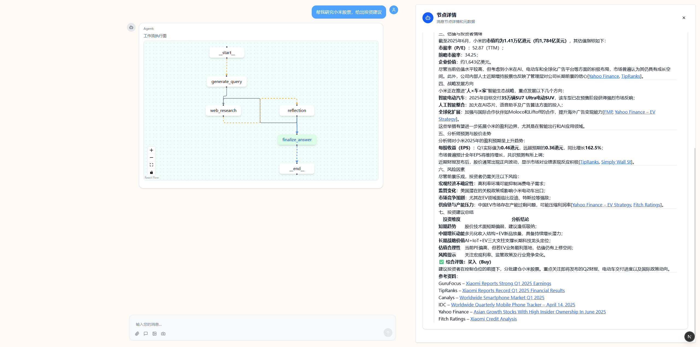

# 📘 Project Overview

This project is a **research agent** built on top of **LangGraph**, designed to perform **multi-step web research tasks** based on user questions. It has been customized from the original repository:  
👉 [gemini-fullstack-langgraph-quickstart](https://github.com/google-gemini/gemini-fullstack-langgraph-quickstart)  
👉 [deer-flow](https://github.com/bytedance/deer-flow)  
The main enhancements include:

---

## 🔧 Core Features

- ✅ **Multi-Engine Search**  
  Supports `Tavily`, `DuckDuckGo`, and `ArXiv` with dynamic engine selection via config

- ✅ **LLM Agnosticism**  
  Abstracted OpenAI-compatible interface supporting Qwen, Alibaba Cloud models, etc.

- ✅ **Stateful Workflows**  
  Built on LangGraph for persistent multi-step reasoning and state management

- ✅ **Runtime Configuration**  
  Adjustable parameters via `RunnableConfig` (search engines, loop limits, prompts)

- ✅ **Real-Time Streaming**  
  Async output streaming for interactive user experience

---

## 🚀 Quick Start

### Prerequisites
1. Create and activate a virtual environment:
   ```bash
   python -m venv .venv
   # macOS/Linux:
   source .venv/bin/activate
   # Windows:
   .venv\Scripts\activate
   ```
   
2. Install dependencies:
     ```bash
     pip install -e .
     ```
   
3. copy `.env.example` to `.env`:
   ```bash
   cp .env.example .env
   ```
4. config your environment variables in `.env`
   ```yaml
   TAVILY_API_KEY = 'your_tavily_api_key'
   ```

5. copy `conf.yaml.example` to `conf.yaml`:
   ```bash
   cp conf.yaml.example conf.yaml
   ```
6. config your environment variables in `conf.yaml`
    ```yaml
   base_url = 'model base url'
   model = 'model name'
   api_key = 'your_api_key'
   ```


### Web Interface Setup
1. Navigate to the web directory:
   ```bash
   cd web
   ```
2. Install frontend dependencies:
   ```bash
   npm install
   ```

3. Start the development server:
   ```bash
   npm run dev
   ```
The application should now be running and accessible in your browser.

---

## 🖥️ Usage Instructions

1. Access the web interface at:  
   🔗 [http://localhost:3000](http://localhost:3000)

2. Enter your research question in the input field, for example:
3. Example interface screenshot:

